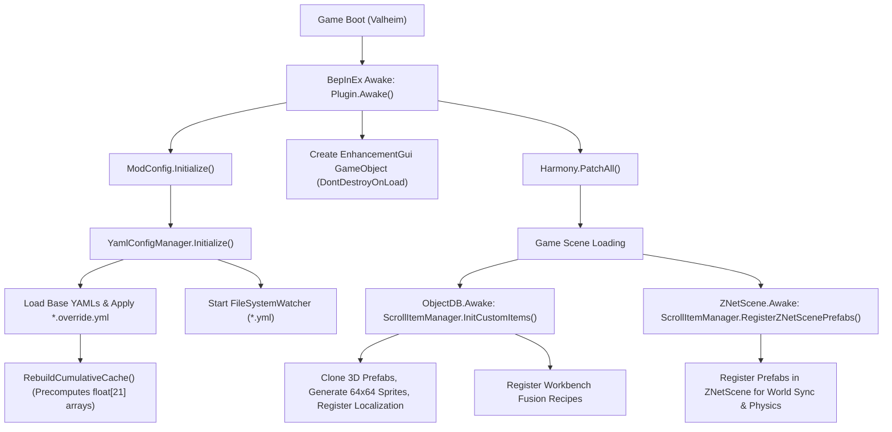
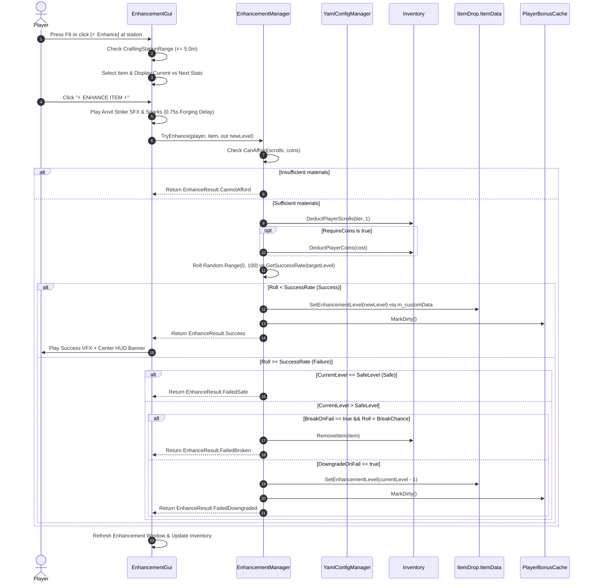
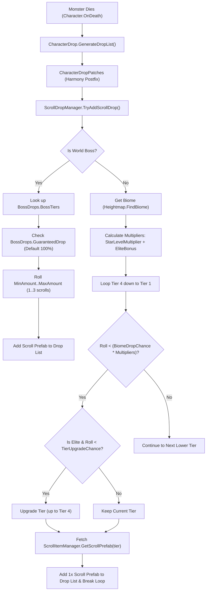

# AGENTS.md: Valheim Item Enhancements (MMORPG Refinement Mod)
> **AI Context & Comprehensive System Architecture Specification**  
> *Target Audience: Autonomous AI Agents, LLM Code Assistants, and Systems Developers.*  
> *Repository: `Valheim.ItemEnhancements` | Mod GUID: `ckforgame.ItemEnhancements`*

---

## 1. Executive Summary & Tech Stack

This repository implements a production-grade MMORPG-style item enhancement system (**+1 to +20**) for the game **Valheim**. Players refine weapons, armor, shields, and utility accessories using tier-specific enhancement scrolls acquired through monster drops and boss encounters, or fused at a workbench.

### Core Technology Stack
- **Game Engine**: Unity 2022.3 LTS (Valheim Mono runtime)
- **Target Framework**: .NET Framework 4.8 (`net48`), C# 10.0 (`<LangVersion>10.0</LangVersion>`)
- **Modding Framework**: BepInEx 5.4.x (`BaseUnityPlugin`)
- **Bytecode Patching**: HarmonyX / Harmony 2.x (`0Harmony.dll`)
- **Configuration & Serialization**: YamlDotNet 13.7.1 + native BepInEx `ConfigFile`
- **UI Framework**: Unity IMGUI (`OnGUI`) for enhancement window + TextMeshPro / Unity UI for native inventory grid & station button integration
- **Persistence Mechanism**: Native `ItemDrop.ItemData.m_customData` key-value dictionary (100% vanilla save-safe)

### Key Architectural Tenets
1. **100% Vanilla Save-Safe**: No custom binary serialization or custom save formats. Enhancement levels and crafter signatures are stored directly in Valheim's native `m_customData` dictionary. Characters and worlds remain fully loadable even if the mod is removed.
2. **Zero In-Game Desync**: Equipment stats are calculated deterministically on both server and client through identical game assembly hooks. Drops and items use standard `ZNetView` network IDs.
3. **Allocation-Free Hot Loops**: Player equipment stat queries in per-frame game loops (such as `GetEquipmentMovementModifier` or `UpdateGui`) query an event-driven cache (`PlayerBonusCache`) with zero allocations and no LINQ.
4. **Modular YAML Configuration with Safe Overrides**: Base configurations (`Item.yml`, `Armor.yml`, `Success.yml`, `Drops.yml`, `Cheat.yml`) are cleanly split. Players customize settings via partial override files (`*.override.yml`) which are immune to being replaced during mod updates.
5. **Live Hot-Reloading**: A background `FileSystemWatcher` with a 300ms debounce timer automatically reloads configs and recalculates cumulative ability lookup tables upon file modification without restarting the game.

---

## 2. High-Level Architecture & Lifecycle Flowcharts

### 2.1 Mod Lifecycle & Initialization Flow


### 2.2 Enhancement Execution Pipeline


### 2.3 Monster Drop Resolution Flow


---

## 3. Directory Layout & Module Breakdown

```
Valheim.ItemEnhancements/
├── Configuration/
│   ├── Yaml/
│   │   ├── AbilityReference.txt   # Canonical dictionary of all 25 Ability IDs & YAML syntax
│   │   ├── Armor.yml              # Armor, shield, mobility stamina, and eitr regen stats (Levels 1-20)
│   │   ├── Cheat.yml              # Opt-in cheat stats (MaxHealth, MaxStamina, MaxEitr, Regens, Healing)
│   │   ├── Drops.yml              # Drop rates by Biome (Tier 1-4), Elite multipliers, Boss drop rules
│   │   ├── Item.yml               # Weapons, tools, durability, weight, carry weight stats (Levels 1-20)
│   │   └── Success.yml            # Success rates (+1 to +20), safe levels, penalties, fees, station rules
│   ├── ckforgame.ItemEnhancements.cfg # BepInEx configuration template (Hotkeys, Badges)
│   ├── ModConfig.cs               # Typed static accessors delegating between BepInEx & YamlConfigManager
│   └── YamlConfigManager.cs       # Engine for loading, merging (*.override.yml), caching & hot-reloading YAMLs
├── Core/
│   ├── EnhancementManager.cs      # Core refinement logic: level queries, persistence, costs, RNG rolls, tooltips
│   ├── PlayerBonusCache.cs        # High-performance event-driven cache for player equipment stats
│   ├── ScrollDropManager.cs       # Calculates monster & boss scroll drop chances and injects loot
│   ├── ScrollItemManager.cs       # Custom scroll item generator: procedural textures, 3D prefabs, recipes, loc
│   └── StatCalculator.cs          # Math & transformation formulas for weapon damages, armor, shields, and cheat stats
├── Patches/
│   ├── CharacterDropPatches.cs    # Harmony patches for drops, ObjectDB/ZNetScene hooks, and prefab cloning guards
│   ├── GameCameraPatches.cs       # Bypasses mouse capture so mouse cursor is free when GUI is open
│   ├── InventoryGridPatches.cs    # Renders colored +X badges on item icons; intercepts clicks while GUI is open
│   ├── InventoryGuiPatches.cs     # Injects [⚡ Enhance] button beside station repair button; manages GUI sync
│   ├── ItemDataPatches.cs         # Intercepts native item stats (damage, armor, block, durability, weight, tooltips)
│   └── PlayerPatches.cs           # Intercepts native player modifiers (movement, dodge/run/jump/block stamina, cheats)
├── UI/
│   └── EnhancementGui.cs          # IMGUI-based refinement window: item picker, diff preview, forging delay, audio/VFX
├── docs/
│   ├── implementation_plan.md     # Development history and architectural blueprint
│   └── walkthrough.md             # Functional verification report and gameplay testing guide
├── manifest.json                  # Thunderstore mod metadata, versioning & dependencies
├── icon.png                       # Thunderstore package icon (exact 256x256 PNG)
├── CHANGELOG.md                   # Mod release history and version notes
├── export-dist.ps1                # Automated Thunderstore export & packaging PowerShell script
├── export-dist.bat                # Windows 1-click batch runner for Thunderstore export
├── package.ps1                    # Shorthand alias for export-dist.ps1
├── package.bat                    # Shorthand alias for export-dist.bat
├── Environment.props              # Local build paths for Valheim installation and r2modman profiles
├── Plugin.cs                      # Mod entry point (BaseUnityPlugin), Harmony bootstrap, GUI spawner, hotkey poll
├── README.md                      # End-user documentation (English & Thai)
├── AGENTS.md                      # This document (AI knowledge base)
├── CLAUDE.md                      # Claude Code CLI quick reference
├── .cursorrules                   # Cursor IDE workspace rules
└── Valheim.ItemEnhancements.csproj# MSBuild project definition with automated dual-deployment & packaging targets
```

---

## 4. Subsystem Details & Technical Specifications

### 4.1 Persistence & Data Schema (`m_customData`)
Valheim's native `ItemDrop.ItemData` contains `public Dictionary<string, string> m_customData`. This dictionary is automatically serialized into player character files (`.fch`) and world container saves (`.db`).

The mod uses two dedicated keys:
- `ValheimEnhancement_Level`: Stored as a string representation of an integer (`"0"` to `"20"`). Accessed via `EnhancementManager.GetEnhancementLevel(item)` and set via `EnhancementManager.SetEnhancementLevel(item, level)`.
- `ValheimEnhancement_Crafter`: Stored as a string holding the name of the player who performed the enhancement.

> **Crucial Rule**: Never add custom components or custom serialization scripts to items or players. All persistent state must reside strictly in `m_customData`.

### 4.2 Configuration Architecture & Safe Overrides

#### Two-Tier Configuration System
1. **BepInEx CFG (`ckforgame.ItemEnhancements.cfg`)**: Used only for user client preferences (e.g. `ToggleGuiKey = KeyCode.F8`, `ShowInventoryBadges = true`).
2. **YAML Subsystem (`BepInEx/config/ckforgame.ItemEnhancements/`)**: Houses game design, balance, progression, success rates, and abilities across 5 modular files.

#### The Safe Override Mechanism (`*.override.yml`)
To solve the common problem of mod updates wiping user balance tweaks, the mod implements partial dictionary merging via `YamlConfigManager.LoadWithOverride<T>`:
- The base file (e.g., `Item.yml`) contains default progression for all levels (1 to 20).
- Users can create a companion file named `Item.override.yml`.
- `ApplyOverrides()` merges only the specified keys or level blocks into the active data model.
- Unspecified levels or properties remain intact from the base file.
- Updating the mod replaces the base `.yml` files with new defaults, but **never overwrites `*.override.yml` files**.

#### Cumulative Calculation Engine
Abilities defined in `Item.yml`, `Armor.yml`, and `Cheat.yml` follow an **incremental specification model**:
- In YAML, a developer specifies only the incremental value gained at that specific level (e.g., Level 1: `WeaponDamage: 5.0`, Level 2: `WeaponDamage: 5.0`).
- During `RebuildCumulativeCache()`, the mod sums all increments from level 1 up to level $L$ for every ability and caches them in a `Dictionary<string, float[21]> _cumulativeCache`.
- At runtime, `YamlConfigManager.GetCumulativeAbilityValue("WeaponDamage", level)` performs an $O(1)$ array lookup with zero memory allocation.

---

## 5. Complete Inventory of Harmony Hooks & Patches

| Patch Class | Target Class & Method | Patch Type | Purpose & Behavior |
|---|---|:---:|---|
| `CharacterDropPatches` | `CharacterDrop.GenerateDropList` | **Postfix** | Calls `ScrollDropManager.TryAddScrollDrop` to roll and inject scroll drops. |
| `CharacterDropPatches` | `CharacterDrop.DropItems` | **Prefix** | Ensures all dropping prefabs have `activeSelf = true` so `Instantiate` spawns active objects. |
| `CharacterDropPatches` | `ObjectDB.Awake` & `CopyOtherDB` | **Postfix** | Calls `ScrollItemManager.InitCustomItems` to register custom scrolls and fusion recipes. |
| `CharacterDropPatches` | `ZNetScene.Awake` | **Postfix** | Calls `ScrollItemManager.RegisterZNetScenePrefabs` and cleans up orphaned ground scrolls. |
| `CharacterDropPatches` | `ZNetView.Awake` | **Prefix** | **Critical Guard**: Returns `false` while `IsCloningCustomPrefab` is true to prevent ZDO assignment on prefab templates. |
| `CharacterDropPatches` | `ItemDrop.Awake` | **Prefix** | **Critical Guard**: Returns `false` while `IsCloningCustomPrefab` is true to prevent templates from entering `s_instances`. |
| `CharacterDropPatches` | `Floating.Awake` | **Prefix** | **Critical Guard**: Returns `false` while `IsCloningCustomPrefab` is true to prevent water buoyancy checks on inactive templates. |
| `CharacterDropPatches` | `Floating.CustomFixedUpdate`| **Prefix/Finalizer** | Suppresses `NullReferenceException` if `m_nview` is null or invalid. |
| `CharacterDropPatches` | `Player.AutoPickup` | **Finalizer** | Catches and suppresses rare NREs during item pickup sweeps. |
| `CharacterDropPatches` | `ZNetScene.RemoveObjects` | **Finalizer** | Suppresses NRE during sector unloading sweeps if an object was externally destroyed. |
| `GameCameraPatches` | `GameCamera.UpdateMouseCapture`| **Prefix** | Unlocks cursor (`CursorLockMode.None`) and skips camera capture while `EnhancementGui.IsOpen`. |
| `InventoryGridPatches` | `InventoryGrid.UpdateGui` | **Postfix** | Renders tier-colored enhancement badges (`+X`) on item quality labels in inventory grids. |
| `InventoryGridPatches` | `InventoryGrid.OnLeftDown` | **Prefix** | When GUI is open, selects clicked item into enhancement slot instead of dragging it. |
| `InventoryGridPatches` | `InventoryGrid.OnLeftClick` | **Prefix** | Suppresses default left-click release handling when GUI is open. |
| `InventoryGridPatches` | `InventoryGrid.OnRightDown` | **Prefix** | When GUI is open, selects clicked item into enhancement slot instead of equipping/using it. |
| `InventoryGuiPatches` | `InventoryGui.Awake` | **Postfix** | Clones station repair button to create `[⚡ Enhance]` button beside it. |
| `InventoryGuiPatches` | `InventoryGui.UpdateRepair` | **Postfix** | Keeps the enhancement button visible and active whenever crafting station is open. |
| `InventoryGuiPatches` | `InventoryGui.Hide` | **Postfix** | Automatically closes the enhancement GUI when the player closes inventory/station. |
| `ItemDataPatches` | `ItemData.GetDamage` | **Postfix** | Multiplies all damage types (Slash, Blunt, Fire, etc.) by weapon bonus factor. |
| `ItemDataPatches` | `ItemData.GetArmor` | **Postfix** | Adds flat armor and percentage-scaled armor bonuses. |
| `ItemDataPatches` | `ItemData.GetBlockPower` | **Postfix** | Adds percentage bonus to shield block power. |
| `ItemDataPatches` | `ItemData.GetDeflectionForce`| **Postfix** | Adds deflection force bonus to shields and weapons. |
| `ItemDataPatches` | `ItemData.GetMaxDurability` | **Postfix** | Adds durability percentage bonus to all equipment. |
| `ItemDataPatches` | `ItemData.GetWeight` | **Postfix** | Multiplies base item weight by `(1 - WeightReduction%)`. |
| `ItemDataPatches` | `ItemData.GetTooltip` | **Postfix** | Appends MMORPG enhancement section, rank, stat breakdowns, and crafter name. |
| `ItemDataPatches` | `ItemDrop.GetHoverText` | **Postfix** | Appends tier-colored `+X` to world ground item hover labels. |
| `PlayerPatches` | `Player.GetEquipmentMovementModifier` | **Postfix** | Offsets armor/shield movement speed penalties with positive enhancement bonuses. |
| `PlayerPatches` | `Player.GetEquipment*StaminaModifier` | **Postfix** | Decreases Dodge, Run, Jump, and Block stamina costs from `PlayerBonusCache`. |
| `PlayerPatches` | `Player.GetEquipmentEitrRegenModifier` | **Postfix** | Adds Eitr regeneration bonus from mage gear. |
| `PlayerPatches` | `Player.GetMaxCarryWeight` | **Postfix** | Adds flat carry weight bonus from utility accessories (e.g. Megingjord). |
| `PlayerPatches` | `Attack.GetAttackStamina` | **Postfix** | Reduces weapon attack stamina cost by `(1 - WeaponAttackStamina%)`. |
| `PlayerPatches` | `Attack.GetAttackEitr` | **Postfix** | Reduces magic staff eitr casting cost by `(1 - WeaponAttackEitr%)`. |
| `PlayerPatches` | `Attack.ModifyDamage` | **Postfix** | Adds sneak attack/backstab multiplier bonus. |
| `PlayerPatches` | `SEMan.ModifyTimedBlockBonus`| **Postfix** | Adds parry multiplier bonus for shields. |
| `PlayerPatches` | `Player.SetMaxHealth / Stamina / Eitr` | **Prefix** | Injects cheat capacity stats if `EnableCheatAbilities` is true. |
| `PlayerPatches` | `SEMan.Modify*Regen` | **Postfix** | Injects cheat Health/Stamina/Eitr regeneration multipliers. |
| `PlayerPatches` | `Character.Heal` | **Prefix** | Multiplies received healing by `(1 + CheatHealingBonus)`. |
| `PlayerPatches` | `Humanoid.EquipItem / UnequipItem` | **Postfix** | Calls `PlayerBonusCache.MarkDirty()` and refreshes player food/stats. |
| `PlayerPatches` | `Player.TakeInput` | **Postfix** | Returns `false` while `EnhancementGui.IsOpen` so player cannot swing weapons or move while in GUI. |

---

## 6. Supported Ability IDs Reference Matrix

All 25 supported ability IDs are detailed below. Use these exact IDs in `Item.yml`, `Armor.yml`, and `Cheat.yml`:

| Ability ID | Target Equipment Types | Config File | Scaling Type | Default Cap at +20 | In-Game Effect |
|---|---|:---:|:---:|:---:|---|
| `WeaponDamage` | Weapons, Bows | `Item.yml` | Percent (`%`) | +50% | Multiplies all base damage types (Slash, Pierce, Blunt, Chop, Pickaxe, Fire, Frost, Lightning, Poison, Spirit). |
| `WeaponBackstab` | Weapons, Knives | `Item.yml` | Multiplier (`+x`) | +0.20x | Increases sneak attack backstab multiplier (e.g. 3.0x -> 3.20x). |
| `WeaponAttackStamina` | Weapons, Bows | `Item.yml` | Percent (`%`) | -10% | Reduces stamina consumed per weapon swing or bow draw. |
| `WeaponAttackEitr` | Magic Staves | `Item.yml` | Percent (`%`) | -4% | Reduces Eitr consumed per spell cast. |
| `MaxDurability` | All Equipment | `Item.yml` | Percent (`%`) | +30% | Increases maximum durability before repair is needed. |
| `WeightReduction` | All Equipment | `Item.yml` | Percent (`%`) | -12% | Decreases inventory weight of the equipment. |
| `CarryWeightBonus` | Utility Accessories | `Item.yml` | Flat (`Units`) | +100 | Increases maximum carrying capacity (e.g., Megingjord belt). |
| `ArmorFlat` | Helmets, Chests, Legs, Cloaks | `Armor.yml` | Flat (`Units`) | +10.0 | Adds direct flat armor defense points. |
| `ArmorPercent` | Helmets, Chests, Legs, Cloaks | `Armor.yml` | Percent (`%`) | +8.0% | Adds percentage-based armor defense points scaled from base armor. |
| `ArmorMovementPenaltyReduction` | Armor, Shields | `Armor.yml` | Percent (`%`) | +50% | Cancels the -5% to -20% movement speed penalty of heavy gear and grants speed bonuses at high levels. |
| `EitrRegen` | Armor, Mage Robes | `Armor.yml` | Percent (`%`) | +20% | Increases player magical Eitr regeneration rate. |
| `ShieldBlockPower` | All Shields | `Armor.yml` | Percent (`%`) | +25% | Increases shield block power value. |
| `ShieldDeflectionForce`| All Shields | `Armor.yml` | Percent (`%`) | +10% | Increases parry pushback/deflection force on attackers. |
| `ShieldTimedBlock` | Bucklers, Round Shields | `Armor.yml` | Multiplier (`+x`) | +0.06x | Increases timed parry bonus damage multiplier. |
| `ShieldBlockStaminaReduction` | All Shields | `Armor.yml` | Percent (`%`) | -4% | Reduces stamina drained when blocking attacks. |
| `DodgeStaminaReduction` | Armor Pieces | `Armor.yml` | Percent (`%`) | -3% | Decreases stamina cost of dodge rolling. |
| `RunStaminaReduction` | Armor Pieces | `Armor.yml` | Percent (`%`) | -2% | Decreases stamina drain rate while sprinting. |
| `JumpStaminaReduction`| Armor Pieces | `Armor.yml` | Percent (`%`) | -2% | Decreases stamina cost of jumping. |
| `MaxHealth` | Armor, Shields, Accessories | `Cheat.yml` | Flat (`HP`) | +100 HP | Directly increases maximum player HP capacity. |
| `MaxStamina` | Armor, Weapons, Accessories | `Cheat.yml` | Flat (`Stamina`) | +100 Stam | Directly increases maximum player stamina capacity. |
| `MaxEitr` | Armor, Weapons, Accessories | `Cheat.yml` | Flat (`Eitr`) | +100 Eitr | Directly increases maximum player Eitr capacity (allows casting without food). |
| `HealthRegen` | Armor, Shields, Accessories | `Cheat.yml` | Percent (`%`) | +100% | Doubles health regeneration rate per equipped piece. |
| `StaminaRegen` | Armor, Shields, Accessories | `Cheat.yml` | Percent (`%`) | +100% | Doubles stamina regeneration rate per equipped piece. |
| `HealingMultiplier` | Armor, Shields, Accessories | `Cheat.yml` | Percent (`%`) | +100% | Multiplies all received healing (potions, regeneration, spells). |

---

## 7. Custom Items: Enhancement Scrolls & Fusion System

### 7.1 Scroll Tiers & Biome Distribution

| Tier | Prefab Name | Target Levels | Color Hex | Primary Biomes & Monsters | Base Drop Rate |
|:---:|:---:|:---:|:---:|---|:---:|
| **1** | `ScrollEnhance_Tier1` | **+1 to +5** | `#4ade80` (Green) | Meadows, Black Forest (Greydwarfs, Skeletons) | 15.0% |
| **2** | `ScrollEnhance_Tier2` | **+6 to +10** | `#22d3ee` (Cyan) | Swamp, Mountain (Draugr, Blobs, Wolves, Drakes) | 10.0% |
| **3** | `ScrollEnhance_Tier3` | **+11 to +15** | `#a855f7` (Purple) | Plains, Mistlands (Fulings, Lox, Seekers, Golems) | 6.0% |
| **4** | `ScrollEnhance_Tier4` | **+16 to +20** | `#f59e0b` (Gold) | Ashlands, Deep North, Gjall, All World Bosses | 3.0% (Boss: 100%) |

### 7.2 Procedural Texture & Prefab Creation
Rather than bundling large Unity AssetBundles, `ScrollItemManager` synthesizes all assets procedurally:
1. **Cloning Base Physics**: Clones `Amber`, `Ruby`, or `Coins` from `ObjectDB` to obtain valid Unity physics, rigidbodies, and audio colliders.
2. **Procedural 64x64 Textures**: `GetOrCreateScrollSprite(tier)` rasterizes aged parchment cylinders, wooden roller dowels, binding ribbons, and illuminated wax seals colored according to the tier.
3. **Tinted 3D World Models**: The spawned 3D mesh material has its shader color tinted to match the scroll tier color.
4. **Workbench Fusion Recipes**:
   - `Recipe_Fusion_ScrollTier2`: 3x Tier 1 -> 1x Tier 2
   - `Recipe_Fusion_ScrollTier3`: 3x Tier 2 -> 1x Tier 3
   - `Recipe_Fusion_ScrollTier4`: 3x Tier 3 -> 1x Tier 4

---

## 8. Critical Gotchas, Edge Cases & Historical Fixes

When modifying or extending this codebase, **always adhere to these proven engineering lessons**:

### 1. Prefab Template Cloning vs ZNetView / ZDO Lifecycle
* **The Problem**: When cloning a base game item via `UnityEngine.Object.Instantiate(baseItem)` to create custom prefabs, Unity triggers `Awake()` on child components. Normally, `ZNetView.Awake()` registers the object into `ZNetScene.m_instances` and requests a network ZDO. However, because this is an inactive template stored in an offline container (`_ItemEnhancements_PrefabContainer`), `ZNetScene.RemoveObjects` identifies it as an invalid out-of-sector object and destroys it. This caused catastrophic `NullReferenceException` loops and prevented scroll items from dropping.
* **The Solution**: Wrap instantiation in `ScrollItemManager.IsCloningCustomPrefab = true` and install prefix guards in `CharacterDropPatches` (`ZNetView.Awake`, `ItemDrop.Awake`, `Floating.Awake`) that return `false` during cloning. This ensures prefabs remain intact as pristine templates without creating premature network entities.

### 2. Crafting Station Proximity Detection
* **The Problem**: Using `Player.GetCurrentCraftingStation()` returns non-null **only** when the player is actively interacting ('E') with the station UI. A player standing right next to their forge pressing `F8` would be rejected.
* **The Solution**: In `EnhancementGui.IsNearCraftingStation()`, we reflect `CraftingStation.m_allStations` and perform a fast squared-distance Euclidean check `(station.transform.position - playerPos).sqrMagnitude <= maxRangeSqr`. The default range is `5.0m` (configurable via `CraftingStationRange`).

### 3. Cursor Locking & Game Camera Interference
* **The Problem**: Valheim's `GameCamera` forcefully locks and hides the cursor every frame via `GameCamera.UpdateMouseCapture()`. If an IMGUI window is drawn, the player cannot click buttons.
* **The Solution**: `GameCameraPatches.UpdateMouseCapture_Patch` intercepts `m_mouseCapture`. When `EnhancementGui.IsOpen` is true, it overrides cursor states (`ZCursor.LockState = CursorLockMode.None`, `ZCursor.Show()`) and returns `false` to skip the game's internal lock. Additionally, `PlayerPatches.Player_TakeInput_Patch` forces `TakeInput` to return `false` so clicking UI buttons does not swing equipped weapons.

### 4. Inventory Click Hijacking
* **The Problem**: Players expected clicking an item in their inventory to place it into the enhancement slot. Vanilla clicks would equip weapons or start dragging them.
* **The Solution**: In `InventoryGridPatches.cs`, `OnLeftDown_Patch` and `OnRightDown_Patch` intercept clicks while `EnhancementGui.IsOpen` is active. If the clicked slot contains an enhanceable item, it invokes `EnhancementGui.SetSelectedItem(item)` and returns `false` to prevent vanilla drag or equip behaviors.

### 5. Cheat Abilities Isolation Gate
* **Rule**: All cheat calculations in `StatCalculator.cs` and hooks in `PlayerPatches.cs` are guarded by `if (!StatCalculator.IsCheatEnabled) return;`. When `EnableCheatAbilities` is false (default), cheat abilities consume zero CPU cycles and contribute zero bonus to player stats.

---

## 9. Developer & Agent Workflow Playbook

### 9.1 Building the Mod
To compile the mod, run from repository root:
```powershell
dotnet build -c Release
```
The `.csproj` contains custom post-build MSBuild targets that automatically copy the compiled `Valheim.ItemEnhancements.dll`, `.pdb`, `.cfg`, and all YAML files directly to both:
- Steam Valheim directory: `C:\Program Files (x86)\Steam\steamapps\common\Valheim\BepInEx\plugins\Valheim.ItemEnhancements`
- r2modman Profile directory (if `R2ModmanProfileDir` is set in `Environment.props`).

### 9.2 In-Game Testing Cheat Sheet
To verify features in-game:
1. Press `F5` to open the console and type `devcommands`.
2. Spawn scrolls:
   - `spawn ScrollEnhance_Tier1 50`
   - `spawn ScrollEnhance_Tier2 50`
   - `spawn ScrollEnhance_Tier3 50`
   - `spawn ScrollEnhance_Tier4 50`
3. Spawn test equipment:
   - `spawn SwordSilver 1`
   - `spawn ArmorIronChest 1`
   - `spawn ShieldSilver 1`
   - `spawn BeltStrength 1`
4. Stand within 5 meters of a Workbench or Forge and press `F8`.
5. Select equipment, verify stat progression diffs, and execute enhancements.
6. Verify tier-colored badges (`+1` to `+20`) in the inventory grid and tooltips.

---
*Document Version: 1.0.0 | Synchronized with Valheim.ItemEnhancements codebase.*
